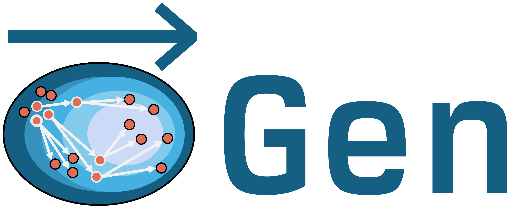

<br>
<p align="center">

</p>
<p align="center">
  <strong>
    Probabilistic programming with programmable inference.
  </strong>
</p>

<div align="center">

[](https://pypi.org/project/GenJAX/)
[](https://codecov.io/gh/chisym/genjax)
[![][jax_badge]](https://github.com/google/jax)
[](https://github.com/astral-sh/ruff)
[](https://beartype.readthedocs.io)
[![Discord Shield][discord]][discord-url]

| **Documentation** |          **Build status**          |
| :---------------: | :--------------------------------: |
| [](https://chisym.github.io/genjax/) [][cookbook] | [![][main_build_action_badge]][main_build_status_url] |

</div>

## What is GenJAX?

(**Probabilistic programming language**) GenJAX is a probabilistic programming language (PPL): a system which provides automation for writing programs which perform computations on probability distributions, including sampling, variational approximation, gradient estimation for expected values, and more.

(**With programmable inference**) The design of GenJAX is centered on _programmable inference_: automation which allows users to express and customize Bayesian inference algorithms (algorithms for computing with posterior distributions: "_x_ affects _y_, and I observe _y_, what are my new beliefs about _x_?"). Programmable inference includes advanced forms of Monte Carlo and variational inference methods.

GenJAX's automation is based on two key concepts: _generative functions_ (GenJAX's version of probabilistic programs) and _traces_ (samples from probabilistic programs). GenJAX provides:
* Modeling language automation for constructing complex probability distributions from pieces
* Inference automation for constructing Monte Carlo samplers using convenient idioms (programs expressed by creating and editing traces), and [variational inference automation](https://dl.acm.org/doi/10.1145/3656463) using [new extensions to automatic differentation for expected values](https://dl.acm.org/doi/10.1145/3571198).

(**Fully vectorized & compatible with JAX**) All of GenJAX's automation is fully compatible with JAX, implying that any program written in GenJAX can be `vmap`'d and `jit` compiled.

<div align="center">
<a href="https://chisym.github.io/genjax/cookbook/">Jump into the notebooks!</a>
<br>
<br>
</div>

> [!TIP]
> GenJAX is part of a larger ecosystem of probabilistic programming tools based upon Gen. [Explore more...](https://www.gen.dev/)

## Seriously, what is it? [](https://colab.research.google.com/drive/1KWMa5No95tMDYEdmA4N0iqVFD-UsCSgp?usp=sharing)

The following code snippet defines a generative function called `beta_bernoulli` which represents [a Beta-Bernoulli model](https://en.wikipedia.org/wiki/Beta-binomial_distribution).

```python
from genjax import beta, flip, gen

# Create a generative model.
@gen
def beta_bernoulli(α, β):
    p = beta(α, β) @ "p"
    v = flip(p) @ "v"
    return v
```

- The _address syntax_ `"p"` and `"v"` denotes _the random variables_ in the program. Here, there are two: a random variable representing a draw from a prior over the probability of success `p` and a random variable for a Bernoulli trial `v`.

- We will observe a coin flip `obs` - in this model, we can exactly compute the mean of the conditional distribution of `p` given `v = obs` using an analytic property called conjugacy.

```python
α, β = 1.0, 1.0
obs = True

def exact_posterior_mean(obs, α, β):
    return (α + obs) / (α + β + 1)

exact_posterior_mean(obs, α, β),
# 0.6666666666666666
```

- But we can also construct an approximate sampler using programmable inference! Programmable inference works for much more complicated models than the Beta-Bernoulli model (models where conjugacy isn't available, for instance).
- We will build an approximate sampler using HMC-within-SIR (mouthful: Hamiltonian Monte Carlo within Sampling Importance Resampling), a type of algorithm in [the sequential Monte Carlo](https://en.wikipedia.org/wiki/Sequential_Monte_Carlo) algorithm family.

```python
from jax import jit
import jax.numpy as jnp
import jax.random as jrand
from genjax import ChoiceMap as Chm
from genjax import Selection as Sel
from genjax.edits import HMC

# Implements HMC-within-SIR:
# create a trace, edit it with HMC, resample.
@jit
def inference_via_editing_traces(key, obs, α, β):
    key, (tr, lws) = beta_bernoulli.importance_k(500)(
        key, # fresh randomness
        Chm.d({"v": obs}), # constraint: "v" -> obs
        (α, β), # (α, β)
    )
    key, (tr, lws_, *_) = tr.edit_k(
        key, # fresh randomness
        # run a single step of HMC for "p" with eps=1e-3.
        HMC(Sel.at["p"], jnp.array(1e-3))
    )
    _, (tr, _) = tr.resample_k(key, lws + lws_)
    return jnp.mean(tr.get_choices()["p"])
```

- GenJAX provides concise idioms to express this algorithm by exposing vectorized interfaces that automate the vectorization and the math (`inference_via_editing_traces`)
- We create 500 properly weighted samples (`importance_k`), then edit all of them (`edit_k`) using HMC applied to the `"p"` variable, keeping track of the weights, and then resample from the edited samples (`resample_k`) and estimate the posterior mean.

**Full snippet:**
```python
import jax
from jax import jit
import jax.numpy as jnp
import jax.random as jrand
import genjax
from genjax import beta, flip, gen
from genjax import ChoiceMap as Chm
from genjax import Selection as Sel
from genjax.edits import HMC

# Create a generative model.
@gen
def beta_bernoulli(α, β):
    p = beta(α, β) @ "p"
    v = flip(p) @ "v"
    return v

def exact_posterior_mean(obs, α, β):
    return (α + obs) / (α + β + 1)

# Implements HMC-within-SIR:
# create a trace, edit it with HMC, resample.
@jit
def inference_via_editing_traces(key, obs, α, β):
    key, (tr, lws) = beta_bernoulli.importance_k(500)(
        key, # fresh randomness
        Chm.d({"v": obs}), # constraint: "v" -> obs
        (α, β), # (α, β)
    )
    key, (tr, lws_, *_) = tr.edit_k(
        key, # fresh randomness
        # run a single step of HMC for "p" with eps=1e-3.
        HMC(Sel.at["p"], jnp.array(1e-3))
    )
    _, (tr, _) = tr.resample_k(key, lws + lws_)
    return jnp.mean(tr.get_choices()["p"])

α, β = 1.0, 1.0
obs = True
(
    exact_posterior_mean(obs, α, β),
    inference_via_editing_traces(jrand.key(1), obs, α, β),
)
# (0.6666666666666666, Array(0.6506245, dtype=float32))
```

## Installing and using GenJAX

To install GenJAX, run

```bash
pip install genjax
```

Then install [JAX](https://github.com/google/jax) using [this
guide](https://jax.readthedocs.io/en/latest/installation.html) to choose the command for the
architecture you're targeting. To run GenJAX without GPU support:

```sh
pip install jax[cpu]~=0.4.24
```

On a Linux machine with a GPU, run the following command:

```sh
pip install jax[cuda12]~=0.4.24
```

## Disclaimer

This is a research project. Expect bugs and sharp edges. Please help by trying out GenJAX, [reporting bugs](https://github.com/ChiSym/genjax/issues), and letting us know what you think!

## Geting involved + support

Pull requests and bug reports are always welcome! Check out our [Contributor's
Guide](CONTRIBUTING.md) for information on how to get started contributing to GenJAX.

The TL;DR; is:

- send us a pull request,
- iterate on the feedback + discussion, and
- get a +1 from a maintainer

in order to get your PR accepted.

Issues should be reported on the [GitHub issue tracker](https://github.com/ChiSym/genjax/issues).

If you want to discuss an idea for a new feature or ask us a question, discussion occurs primarily in the body of [Github Issues](https://github.com/ChiSym/genjax/issues)

## Citing GenJAX

If you're using GenJAX for your research, there are multiple ways to cite it:
- If you'd like to cite the software, use the [`CITATION.cff`](https://github.com/ChiSym/genjax/blob/main/CITATION.cff)
- If you'd like to cite academic papers about the software, please use the following BibTeX entry for [our initial work on programmable variational inference](https://dl.acm.org/doi/10.1145/3656463):

```bibtex
@article{10.1145/3656463,
    author = {Becker, McCoy R. and Lew, Alexander K. and Wang, Xiaoyan and Ghavami, Matin and Huot, Mathieu and Rinard, Martin C. and Mansinghka, Vikash K.},
    title = {Probabilistic Programming with Programmable Variational Inference},
    year = {2024},
    issue_date = {June 2024},
    publisher = {Association for Computing Machinery},
    address = {New York, NY, USA},
    volume = {8},
    number = {PLDI},
    url = {https://doi.org/10.1145/3656463},
    doi = {10.1145/3656463},
    journal = {Proc. ACM Program. Lang.},
    month = jun,
    articleno = {233},
    numpages = {25},
    keywords = {automatic differentiation, correctness, probabilistic programming, semantics, variational inference}
}
```

We will continue to add papers as we put them out.


## References

Many bits of knowledge have gone into this project -- [you can find many of these bits at the MIT Probabilistic Computing Project page](http://probcomp.csail.mit.edu/) under publications. Here's an abbreviated list of high value references:

- [Marco Cusumano-Towner's thesis on Gen][marco_thesis]
- [The main Gen.jl repository][gen_jl]
- (Trace types) [(Lew et al) trace types][trace_types]
- (RAVI) [(Lew et al) Recursive auxiliary-variable inference][ravi]
- (GenSP) [Alex Lew's Gen.jl implementation of GenSP][gen_sp]
- (ADEV) [(Lew & Huot, et al) Automatic differentiation of expected values of probabilistic programs][adev]

### JAX influences

This project has several JAX-based influences. Here's an abbreviated list:

- [This notebook on static dispatch (Dan Piponi)][effect_handling_interp]
- [Equinox (Patrick Kidger's work on neural networks via callable Pytrees)][equinox]
- [Oryx (interpreters and interpreter design)][oryx]

### Acknowledgements

The maintainers of this library would like to acknowledge the JAX and Oryx maintainers for useful discussions and reference code for interpreter-based transformation patterns.

<div align="center">
Created and maintained by the <a href="http://probcomp.csail.mit.edu/">MIT Probabilistic Computing Project</a>. All code is licensed under the <a href="LICENSE">Apache 2.0 License</a>.
</div>

[actions]: https://github.com/chisym/genjax/actions
[adev]: https://arxiv.org/abs/2212.06386
[cookbook]: https://chisym.github.io/genjax/cookbook/
[coverage_badge]: https://github.com/chisym/genjax/coverage.svg
[discord-url]: https://discord.gg/UTJj3zmJYb
[discord]: https://img.shields.io/discord/1331245195618029631?style=flat-square&colorA=000000&colorB=000000&label=&logo=discord
[effect_handling_interp]: https://colab.research.google.com/drive/1HGs59anVC2AOsmt7C4v8yD6v8gZSJGm6#scrollTo=ukjVJ2Ls_6Q3
[equinox]: https://github.com/patrick-kidger/equinox
[gen_jl]: https://github.com/probcomp/Gen.jl
[gen_sp]: https://github.com/probcomp/GenSP.jl
[jax_badge]: https://img.shields.io/badge/JAX-Accelerated-9cf.svg?style=flat-square&logo=data:image/png;base64,iVBORw0KGgoAAAANSUhEUgAAAC0AAAAaCAYAAAAjZdWPAAAIx0lEQVR42rWWBVQbWxOAkefur%2B7u3les7u7F3ZIQ3N2tbng8aXFC0uAuKf2hmlJ3AapIgobMv7t0w%2Ba50JzzJdlhlvNldubeq%2FY%2BXrTS1z%2B6sttrKfQOOY4ns13ecFImb47pVvIkukNe4y3Junr1kSZ%2Bb3Na248tx7rKiHlPo6Ryse%2F11NKQuk%2FV3tfL52yHtXm8TGYS1wk4J093wrPQPngRJH9HH1x2fAjMhcIeIaXKQCmd2Gn7IqSvG83BueT0CMkTyESUqm3vRRggTdOBIb1HFDaNl8Gdg91AFGkO7QXe8gJInpoDjEXC9gbhtWH3rjZ%2F9yK6t42Y9zyiC1iLhZA8JQe4eqKXklrJF0MqfPv2bc2wzPZjpnEyMEVlEZCKQzYCJhE8QEtIL1RaXEVFEGmEaTn96VuLDzWflLFbgvqUec3BPVBmeBnNwUiakq1I31UcPaTSR8%2B1LnditsscaB2A48K6D9SoZDD2O6bELvA0JGhl4zIYZzcWtD%2BMfdvdHNsDOHciXwBPN18lj7sy79qQCTNK3nxBZXakqbZFO2jHskA7zBs%2BJhmDmr0RhoadIZjYxKIVHpCZngPMZUKoQKrfEoz1PfZZdKAe2CvP4XnYE8k2LLMdMumwrLaNlomyVqK0UdwN%2BD7AAz73dYBpPg6gPiCN8TXFHCI2s7AWYesJgTabD%2FS5uXDTuwVaAvvghncTdk1DYGkL0daAs%2BsLiutLrn0%2BRMNXpunC7mgkCpshfbw4OhrUvMkYo%2F0c4XtHS1waY4mlG6To8oG1TKjs78xV5fAkSgqcZSL0GoszfxEAW0fUludRNWlIhGsljzVjctr8rJOkCpskKaDYIlgkVoCmF0kp%2FbW%2FU%2F%2B8QNdXPztbAc4kFxIEmNGwKuI9y5gnBMH%2BakiZxlfGaLP48kyj4qPFkeIPh0Q6lt861zZF%2BgBpDcAxT3gEOjGxMDLQRSn9XaDzPWdOstkEN7uez6jmgLOYilR7NkFwLh%2B4G0SQMnMwRp8jaCrwEs8eEmFW2VsNd07HQdP4TgWxNTYcFcKHPhRYFOWLfJJBE5FefTQsWiKRaOw6FBr6ob1RP3EoqdbHsWFDwAYvaVI28DaK8AHs51tU%2BA3Z8CUXvZ1jnSR7SRS2SnwKw4O8B1rCjwrjgt1gSrjXnWhBxjD0Hidm4vfj3e3riUP5PcUCYlZxsYFDK41XnLlUANwVeeILFde%2BGKLhk3zgyZNeQjcSHPMEKSyPPQKfIcKfIqCf8yN95MGZZ1bj98WJ%2BOorQzxsPqcYdX9orw8420jBQNfJVVmTOStEUqFz5dq%2F2tHUY3LbjMh0qYxCwCGxRep8%2FK4ZnldzuUkjJLPDhkzrUFBoHYBjk3odtNMYoJVGx9BG2JTNVehksmRaGUwMbYQITk3Xw9gOxbNoGaA8RWjwuQdsXdGvpdty7Su2%2Fqn0qbzWsXYp0nqVpet0O6zzugva1MZHUdwHk9G8aH7raHua9AIxzzjxDaw4w4cpvEQlM84kwdI0hkpsPpcOtUeaVM8hQT2Qtb4ckUbaYw4fXzGAqSVEd8CGpqamj%2F9Q2pPX7miW0NlHlDE81AxLSI2wyK6xf6vfrcgEwb0PAtPaHM1%2BNXzGXAlMRcUIrMpiE6%2Bxv0cyxSrC6FmjzvkWJE3OxpY%2BzmpsANFBxK6RuIJvXe7bUHNd4zfCwvPPh9unSO%2BbIL2JY53QDqvdbsEi2%2BuwEEHPsfFRdOqjHcjTaCLmWdBewtKzHEwKZynSGgtTaSqx7dwMeBLRhR1LETDhu76vgTFfMLi8zc8F7hoRPpAYjAWCp0Jy5dzfSEfltGU6M9oVCIATnPoGKImDUJNfK0JS37QTc9yY7eDKzIX5wR4wN8RTya4jETAvZDCmFeEPwhNXoOlQt5JnRzqhxLZBpY%2BT5mZD3M4MfLnDW6U%2Fy6jkaDXtysDm8vjxY%2FXYnLebkelXaQtSSge2IhBj9kjMLF41duDUNRiDLHEzfaigsoxRzWG6B0kZ2%2BoRA3dD2lRa44ZrM%2FBW5ANziVApGLaKCYucXOCEdhoew5Y%2Btu65VwJqxUC1j4lav6UwpIJfnRswQUIMawPSr2LGp6WwLDYJ2TwoMNbf6Tdni%2FEuNvAdEvuUZAwFERLVXg7pg9xt1djZgqV7DmuHFGQI9Sje2A9dR%2FFDd0osztIRYnln1hdW1dff%2B1gtNLN1u0ViZy9BBlu%2BzBNUK%2BrIaP9Nla2TG%2BETHwq2kXzmS4XxXmSVan9KMYUprrbgFJqCndyIw9fgdh8dMvzIiW0sngbxoGlniN6LffruTEIGE9khBw5T2FDmWlTYqrnEPa7aF%2FYYcPYiUE48Ul5jhP82tj%2FiESyJilCeLdQRpod6No3xJNNHeZBpOBsiAzm5rg2dBZYSyH9Hob0EOFqqh3vWOuHbFR5eXcORp4OzwTUA4rUzVfJ4q%2FIa1GzCrzjOMxQr5uqLAWUOwgaHOphrgF0r2epYh%2FytdjBmUAurfM6CxruT3Ee%2BDv2%2FHAwK4RUIPskqK%2Fw4%2FR1F1bWfHjbNiXcYl6RwGJcMOMdXZaEVxCutSN1SGLMx3JfzCdlU8THZFFC%2BJJuB2964wSGdmq3I2FEcpWYVfHm4jmXd%2BRn7agFn9oFaWGYhBmJs5v5a0LZUjc3Sr4Ep%2FmFYlX8OdLlFYidM%2B731v7Ly4lfu85l3SSMTAcd5Bg2Sl%2FIHBm3RuacVx%2BrHpFcWjxztavOcOBcTnUhwekkGlsfWEt2%2FkHflB7WqKomGvs9F62l7a%2BRKQQQtRBD9VIlZiLEfRBRfQEmDb32cFQcSjznUP3um%2FkcbV%2BjmNEvqhOQuonjoQh7QF%2BbK811rduN5G6ICLD%2BnmPbi0ur2hrDLKhQYiwRdQrvKjcp%2F%2BL%2BnTz%2Fa4FgvmakvluPMMxbL15Dq5MTYAhOxXM%2FmvEpsoWmtfP9RxnkAIAr%2F5pVxqPxH93msKodRSXIct2l0OU0%2FL4eY506L%2B3GyJ6UMEZfjjCDbysNcWWmFweJP0Jz%2FA0g2gk80pGkYAAAAAElFTkSuQmCC
[main_build_action_badge]: https://github.com/chisym/genjax/actions/workflows/ci.yml/badge.svg?style=flat-square&branch=main
[main_build_status_url]: https://github.com/chisym/genjax/actions/workflows/ci.yml?query=branch%3Amain
[marco_thesis]: https://www.mct.dev/assets/mct-thesis.pdf
[oryx]: https://github.com/jax-ml/oryx
[ravi]: https://arxiv.org/abs/2203.02836
[trace_types]: https://dl.acm.org/doi/10.1145/3371087
